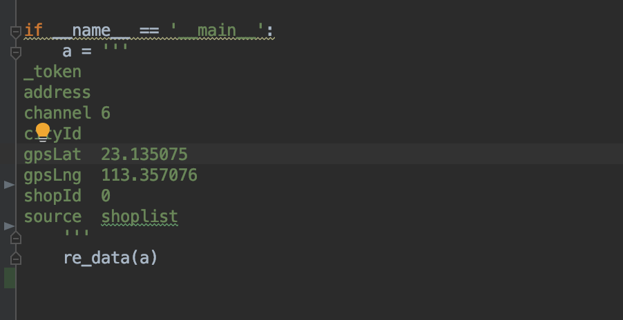
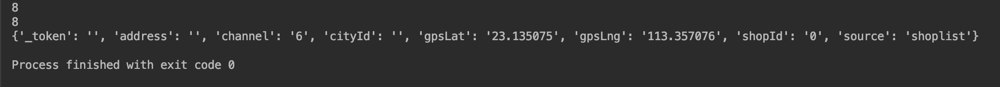

## 说明
* 此工具类主要为了解决使用fiddler进行抓包时将header，data，cookie快速转换为python的字典的方法。

* 需在python3下使用

## 使用方法
以get_data.py举例:

> 1. 将WebForms下的值复制出来

> 2. 运行后的结果为：

> 最后一行的值便是python的字典格式，也是requests,scrapy支持的data格式。

## 注意
* get_headers.py 仅支持解析从`Raw`里复制出来的值
* get_data.py 仅支持解析从`WebForms`里复制出来的值
* get_cookie.py 仅支持解析从`Cookies`里复制出来的值
